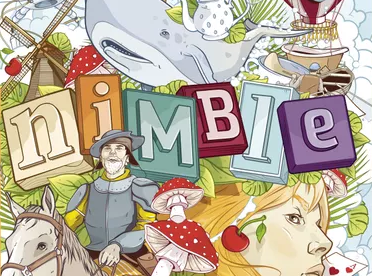

# Nimble Online

## Integrantes

| Nombre |
| ------------------------------------------------------------- |
| [BIANCARDI, Julian](https://github.com/JulianBiancardi)|
| [MICELI, Juan Pablo](https://github.com/juanPabloMiceli)|
     

# Indice   
1. [Introducción](#id1)
2. [Imagenes](#id2)

## 1. Introducción

Este juego, inspirado en el original Nimble, es un trabajo personal para aprender el desarrollo de paginas web, asi como tambien el lenguaje de programación **JavaScript**.

Link de la pagina web: http://nimble.jpmiceli.com.ar

## 2. Imagenes

 - Imagenes del juego
  

